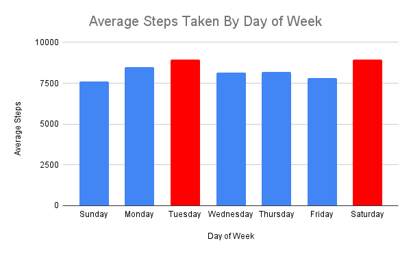
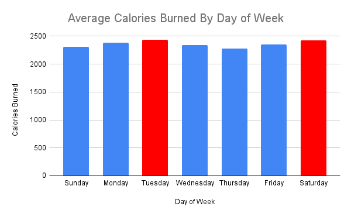
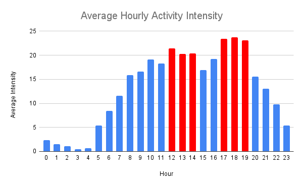
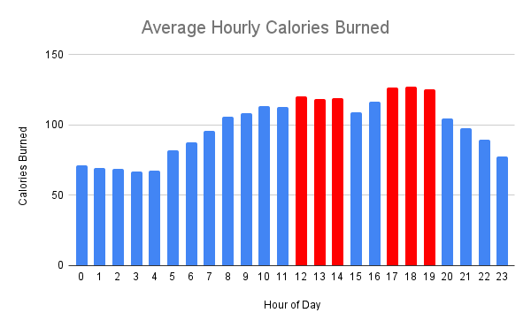
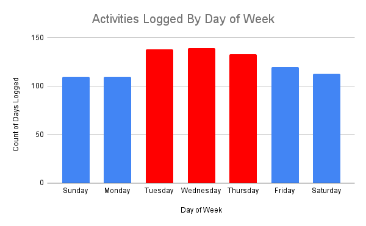
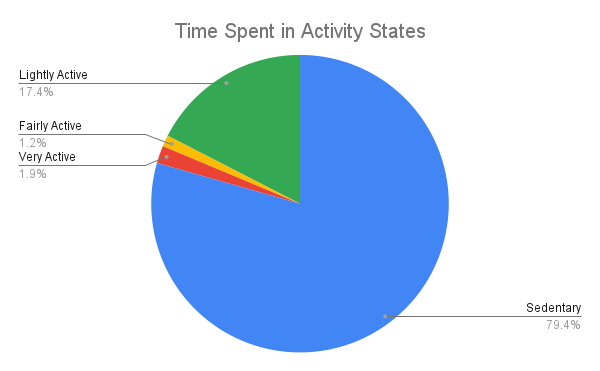
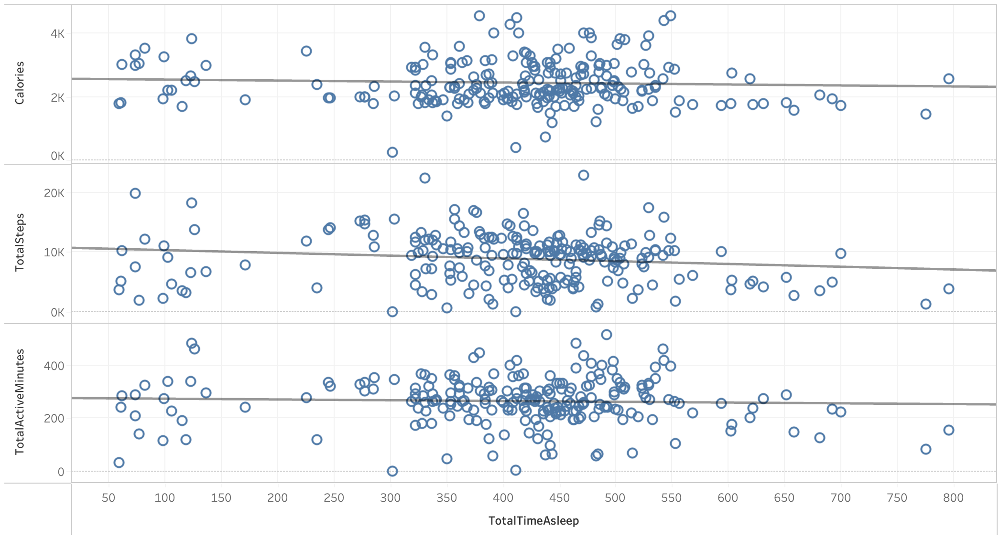

# Bellabeat Fitness Tracker Case Study

By Zach Richardson

Last Updated: 8/14/2023

## ASK

### Case Study Description:

You are a junior data analyst working on the marketing analyst team at Bellabeat, a high-tech manufacturer of health-focused products for women. Bellabeat is a successful small company, but they have the potential to become a larger player in the global smart device market. Urška Sršen, cofounder and Chief Creative Officer of Bellabeat, believes that analyzing smart device fitness data could help unlock new growth opportunities for the company. You have been asked to focus on one of Bellabeat’s products and analyze smart device data to gain insight into how consumers are using their smart devices. The insights you discover will then help guide marketing strategy for the company. You will present your analysis to the Bellabeat executive team along with your high-level recommendations for Bellabeat’s marketing strategy. Urška has provided a [dataset](https://www.kaggle.com/datasets/arashnic/fitbit) from FitBit users to analyze for trends in smart device usage.

### Questions to be answered:

* What trends exist in smart device usage?
* How could these trends apply to Bellabeat customers?
* How could these trends help influence Bellabeat marketing strategy?

### Deliverables:

* A clear summary of the business task
* A description of all data sources used
* Documentation of any cleaning or manipulation of data
* A summary of your analysis
* Supporting Viz and key findings
* High level content recommendations

### Stakeholders

* Urška Sršen - Chief Creative Officer
* Sando Mur - Bellabeat Cofounder

  

## Prepare

### Data Source:

https://www.kaggle.com/datasets/arashnic/fitbit

### Data Description:

The data source for this project is a collection of FitBit fitness tracker data submitted from thirty users as part of a survey via Amazon Mechanical Turk between 3/12/16 and 5/12/16. The data includes daily, hourly, and minute-based data on metrics such as steps, calories burned, time spent asleep, and activity intensity. The majority of the data is qualitative and discrete, stored in long format in CSV files. The data is public domain and the users have consented to the use of their data for this dataset. 
	Analyzing the trends in this dataset will allow Bellabeat to better understand the usage patterns of customers using fitness tracking products. With this information, the business will be able to construct more effective marketing campaigns and better target potential customers.

### Data Quality Evaluation:

* Reliable - LOW - No evidence that data has been vetted
* Original - MED - Data aggregated on individual's Fitbit devices, collected via survey by a third-party source
* Comprehensive - MED - The collection contains data from 30 users in a span of 2 months.
* Current - LOW - The data was collected and submitted in 2016
* Cited - LOW - Data is cited [here](https://zenodo.org/record/53894#.YMoUpnVKiP9), but with minimal information

### Data Limitations:

* Data is from an unverified third-party source
* Data was collected as a survey - Cannot verify that users have submitted accurate data
* Data is from 2016 - Usage habits may have changed over time
* Data is limited to 2-month span - Usage habits may change at different parts of the year
* Data consists of 30 users of unknown gender - Bellabeat is targeting female customers, men and women may have different usage habits

  

## Process
### Tools

* SQL (BigQuery)
* Excel (Google Sheets)
* Tableau

I have decided to use SQL for analysis, as some of the tables in this dataset contain millions of rows, making parts of it unsuitable for excel. SQL is a more effective tool for cleaning and analyzing large data sets. After the data has been cleaned and paired down, I will be using Excel and Tableau to generate the visuals for the analysis and presentation.

### Data Cleaning

#### Formatting Timestamps As Type Datetime

When importing the data into BigQuery, the timestamp columns in the hourly, daily, and minute CSVs could not be imported as datetime values, only as strings. My first step in the process phase was to modify the tables to recognize these values as type datetime, and store them in a column of the appropriate type. After the values had been formatted and moved, it was necessary to remove the existing String-type timestamp field.

~~~ 
--Create new column of type datetime
ALTER TABLE 
  `testsandbox-391419.Bellabeat.hourly_intensity` 
ADD COLUMN 
  TimestampValue datetime;
~~~
~~~
--Populate column with timestamp values parsed as datetime
UPDATE 
  `testsandbox-391419.Bellabeat.hourly_intensity` 
SET 
  TimestampValue = PARSE_DATETIME('%m/%d/%Y %I:%M:%S %p', timestamp) 
WHERE 
  timestamp IS NOT NULL;
~~~
~~~
--Remove the existing timestamp column of type 'String'
ALTER TABLE 
  `testsandbox-391419.Bellabeat.hourly_intensity` 
DROP COLUMN 
  timestamp;
~~~

#### Standardizing Column Names

When examining the data schemas, I found that there are many inconsistencies in the naming conventions. The majority were already in CamelCase, so I went through and ensured that all columns adhere to this convention. 

~~~
ALTER TABLE
  `testsandbox-391419.Bellabeat.day_sleep` RENAME COLUMN total_records TO TotalRecords;
ALTER TABLE
  `testsandbox-391419.Bellabeat.day_sleep` RENAME COLUMN total_minutes_asleep TO TotalMinutesAsleep;
ALTER TABLE
  `testsandbox-391419.Bellabeat.day_sleep` RENAME COLUMN total_minutes_in_bed TO TotalMinutesInBed;
ALTER TABLE
  `testsandbox-391419.Bellabeat.hourly_intensity` RENAME COLUMN total_intensity TO TotalIntensity;
ALTER TABLE
  `testsandbox-391419.Bellabeat.hourly_intensity` RENAME COLUMN average_intensity TO AverageIntensity;
~~~

#### Verifying Data Timespan

I verified the date range of the daily_activity table and found that the range of dates is from 4/12/16 to 5/12/16, comprising one month of data. This is less than the 2 months stated in the dataset description.

~~~
SELECT 
  ActivityDate 
FROM 
  `testsandbox-391419.Bellabeat.daily_activity` 
ORDER BY 
  ActivityDate 
LIMIT 1;

SELECT 
  ActivityDate 
FROM 
  `testsandbox-391419.Bellabeat.daily_activity` 
ORDER BY 
  ActivityDate DESC
LIMIT 1;
~~~

#### Verifying User Count
Next I checked on the number of IDs in the data and found that there are 33, not the stated 30. In order to verify that this was not due to one-time user errors in entering the data, I checked how many records exist for each id, and found that the IDs all have multiple valid records tied to them.

~~~
--Get number of distinct users
SELECT COUNT(DISTINCT id) FROM `testsandbox-391419.Bellabeat.daily_activity`;
~~~
~~~
--Get number of records that exist for each user
SELECT
  Id,
  COUNT(*)
FROM
  `testsandbox-391419.Bellabeat.daily_activity`
GROUP BY
  Id;
~~~

#### Check For Duplicate Records
I checked the Daily_Activity table for instances of multiple daily entries and/or duplicate values, and found that there were none.

~~~
SELECT
  Id,
  ActivityDate,
  COUNT(*)
FROM
  `testsandbox-391419.Bellabeat.daily_activity`
GROUP BY
  Id,
  ActivityDate
HAVING
  COUNT(*) > 1;
~~~

#### Check For Nulls

I checked the data for nulls by going through each table and running the following command. I found that there were no unexpected null values in the data.

~~~
--Check basic data table for nulls
SELECT
  COUNT(*)
FROM
  `testsandbox-391419.Bellabeat.hourly_intensity`
WHERE
  id IS NULL
  OR Value IS NULL
  OR TimestampValue IS NULL;
~~~

Next I checked the columns of the daily_activity table for nulls and found none.

~~~
--Check individual fields for null in daily_activity master table
SELECT 
  SUM(CASE WHEN id IS NULL THEN 1 ELSE 0 END) AS id,
  SUM(CASE WHEN ActivityDate IS NULL THEN 1 ELSE 0 END) AS ActivityDate,
  SUM(CASE WHEN TotalSteps IS NULL THEN 1 ELSE 0 END) AS TotalSteps,
  SUM(CASE WHEN TotalDistance IS NULL THEN 1 ELSE 0 END) AS TotalDistance,
  SUM(CASE WHEN TrackerDistance IS NULL THEN 1 ELSE 0 END) AS TrackerDistance,
  SUM(CASE WHEN LoggedActivitiesDistance IS NULL THEN 1 ELSE 0 END) AS LoggedActivitiesDistance,
  SUM(CASE WHEN VeryActiveDistance IS NULL THEN 1 ELSE 0 END) AS VeryActiveDistance,
  SUM(CASE WHEN ModeratelyActiveDistance IS NULL THEN 1 ELSE 0 END) AS ModeratelyActiveDistance,
  SUM(CASE WHEN LightActiveDistance IS NULL THEN 1 ELSE 0 END) AS LightActiveDistance, 
  SUM(CASE WHEN SedentaryActiveDistance IS NULL THEN 1 ELSE 0 END) AS SedentaryActiveDistance,
  SUM(CASE WHEN VeryActiveMinutes IS NULL THEN 1 ELSE 0 END) AS VeryActiveMinutes,
  SUM(CASE WHEN FairlyActiveMinutes IS NULL THEN 1 ELSE 0 END) AS FairlyActiveMinutes,
  SUM(CASE WHEN LightlyActiveMinutes IS NULL THEN 1 ELSE 0 END) AS LightlyActiveMinutes,
  SUM(CASE WHEN SedentaryMinutes IS NULL THEN 1 ELSE 0 END) AS SedentaryMinutes,
  SUM(CASE WHEN Calories IS NULL THEN 1 ELSE 0 END) AS Calories,
FROM
`testsandbox-391419.Bellabeat.daily_activity`;
~~~

#### Create Data Fields for Total Activity Time and Total Intensity Value
To aid in analysis, I created a new column in daily_activity that aggregates the amount of daily active minutes, using sum of the sedentary, lightly active, faily active, and very active minutes.

~~~
ALTER TABLE 
  `testsandbox-391419.Bellabeat.daily_activity` 
ADD COLUMN
  TotalMinutesTracked INTEGER;
~~~
~~~
UPDATE 
  `testsandbox-391419.Bellabeat.daily_activity` 
SET 
  TotalMinutesTracked = (SedentaryMinutes + LightlyActiveMinutes + FairlyActiveMinutes + VeryActiveMinutes);
~~~

I also added a column to daily_activity that calculates the total activity intensity, using the formula used in the hourly and minute tables, as described in the data dictionary. Light Activity = 1, Moderate Activity = 2, Very Active = 3.

~~~
ALTER TABLE 
  `testsandbox-391419.Bellabeat.daily_activity` 
ADD COLUMN
  TotalIntensityValue INTEGER;
~~~
~~~
UPDATE 
  `testsandbox-391419.Bellabeat.daily_activity` 
SET 
  TotalIntensityValue = (LightlyActiveMinutes + (FairlyActiveMinutes * 2) + (VeryActiveMinutes * 3));
~~~

#### Data Anomalies

When analyzing the data I found that there were 77 records in the daily_activity table that contained the value of zero for nearly every metric, including StepsTaken. Seeing as it is nearly impossible for a person to take 0 steps throughout an entire day, I have the assumption that the device was being used incorrectly, and removed the data for these user id and date combinations from the data set, viewing these as anomalies.

In order to clean the data of these anomalies, I needed to find the corresponding data points in the other tables that match with this id and date and remove those records.

In order to reference these records directly, I decided to first add unique identifiers.

~~~
--Find instances of days with 0 steps taken
SELECT
  *
FROM
  `testsandbox-391419.Bellabeat.daily_activity`
WHERE
  TotalSteps = 0;
~~~

~~~
--Assign unique IDs to records to be able to find and delete anomalies
ALTER TABLE
  `testsandbox-391419.Bellabeat.hourly_intensity` 
ADD COLUMN 
  record_id STRING;

ALTER TABLE
  `testsandbox-391419.Bellabeat.hourly_intensity`
ADD PRIMARY KEY
  (record_id) NOT ENFORCED;

UPDATE
  `testsandbox-391419.Bellabeat.hourly_intensity`
SET
  record_id = GENERATE_UUID()
WHERE
  1=1;
~~~

Once the records were assigned with an identifier, I used the following query to find the corresponding records by id and delete them, applying this query to each of the data tables.

~~~
--Remove data table entries corresponding to the userId+date where 0 steps taken
DELETE
FROM
  `testsandbox-391419.Bellabeat.hourly_intensity`
WHERE
  record_id IN (
  SELECT
    c.record_id
  FROM
    `testsandbox-391419.Bellabeat.hourly_intensity` c
  LEFT JOIN
    `testsandbox-391419.Bellabeat.daily_activity` a
  ON
    a.id = c.id
    AND a.ActivityDate = CAST(c.TimestampValue AS DATE)
  WHERE
    a.TotalSteps = 0);
~~~

And finally I deleted the records directly from the DailyActivityTable

~~~
--Delete directly from DailyActivityTable
DELETE
FROM
  `testsandbox-391419.Bellabeat.daily_activity`
WHERE
  TotalSteps = 0;
~~~

  

## Analysis

#### Activity Patterns by Day of the Week
###### Average Steps Taken
The first step in my analysis was to look for trends in users activity patterns on days of the week. What days of the week are people exercising the most/least? First I looked at the average number of steps taken for each day and found that the steps taken were highest on Tuesday and Saturday, and lowest on Sunday.

~~~
--Calculate average steps taken for each day of the week
SELECT
  FORMAT_DATETIME('%A', ActivityDate) DayOfWeek,
  AVG(TotalSteps) AvgSteps
FROM
  `testsandbox-391419.Bellabeat.daily_activity`
GROUP BY
  DayOfWeek
ORDER BY
  AvgSteps DESC;
~~~
~~~
--Output
DayOfWeek		AvgSteps
Tuesday			8949.282609
Saturday		8946.628319
Monday			8488.218182
Thursday		8185.398496
Wednesday		8157.597122
Friday			7820.641667
Sunday			7626.554545
~~~

###### Average Active Minutes
Next I looked at the average daily activity intensity value. I found that this followed a similar pattern to steps taken, with  activity peaking on Saturday and Tuesday, and falling on Sunday.

~~~
--Calculate average daily intensity value
SELECT
  FORMAT_DATETIME('%A', ActivityDate) DayOfWeek,
  AVG(TotalIntensityValue) AvgIntensityValue
FROM
  `testsandbox-391419.Bellabeat.daily_activity`
GROUP BY
  DayOfWeek
ORDER BY
  AvgIntensityValue DESC;
~~~

~~~
--Output
DayOfWeek	AvgIntensityValue
Saturday	331.9557522
Tuesday		324.7898551
Monday		315.6909091
Friday		303.0166667
Wednesday	300.4244604
Thursday	295.7293233
Sunday		289.2818182
~~~

###### Average Calories Burned

Finally, I took the average number of calories burned for each day of the week, and found a continuation of the pattern, with Tuesday and Saturday at the top and Sunday near the bottom.

~~~
--Calculate average number of calories burned for each day of the week
SELECT
  FORMAT_DATETIME('%A', ActivityDate) DayOfWeek,
  AVG(Calories) Calories
FROM
  `testsandbox-391419.Bellabeat.daily_activity`
GROUP BY
  DayOfWeek
ORDER BY
  Calories DESC;
~~~
~~~
--Output
DayOfWeek	Calories
Tuesday		2440.978261
Saturday	2428.752212
Monday		2385.618182
Friday		2351.608333
Wednesday	2339.431655
Sunday		2310.927273
Thursday	2274.43609
~~~

#### Activity Patterns by Hour of the Day
###### Average Steps Taken
The next step in my analysis was to identify trends in the hourly activity of the users. When are users most active each day? I found that the two timeframes that people are taking the most steps are from 12pm-3pm and 5-8pm.

~~~
--Calculate average steps taken in each hour of the day
SELECT 
  FORMAT_DATETIME('%T', timestampValue) hour, AVG(value) avg_steps 
FROM 
  `testsandbox-391419.Bellabeat.hourly_steps` 
GROUP BY 
  hour 
ORDER BY 
  avg_value DESC
LIMIT 10;
~~~
~~~
--Output
hour		avg_steps
18:00:00	648.5639188
19:00:00	631.483871
17:00:00	595.5925926
12:00:00	593.7183099
14:00:00	584.9741481
13:00:00	581.9271445
16:00:00	537.7553699
10:00:00	521.52331
11:00:00	494.2053676
9:00:00		469.0744186
~~~

###### Average Hourly Activity Intensity
Using the hourly_intensity table, I found the average activity intensity for each hour of the day, and found that the same timeframes as above had the highest average intensity. 

~~~
--Calculate average activity intensity for each hour of the day
SELECT 
  FORMAT_DATETIME('%T', timestampValue) hour, 
  AVG(TotalIntensity) avg_intensity 
FROM 
  `testsandbox-391419.Bellabeat.hourly_intensity` 
GROUP BY 
  hour 
ORDER BY 
  avg_value DESC
LIMIT 
	10;
~~~
~~~
--Output
hour		avg_intensity
18:00:00	23.72879331
17:00:00	23.44086022
19:00:00	23.14814815
12:00:00	21.47769953
14:00:00	20.42068155
13:00:00	20.31962397
16:00:00	19.17541766
10:00:00	19.07226107
11:00:00	18.3033839
15:00:00	16.87573964
~~~

###### Average Calories Burned
Finally, I took the average number of calories burned for each hour of the day and again found the timeframes of 12-3pm and 5-8pm to have the highest values.

~~~
--Calculate average calories burned each hour of the day
SELECT 
  FORMAT_DATETIME('%T', timestampValue) hour, 
  AVG(value) avg_calories 
FROM 
  `testsandbox-391419.Bellabeat.hourly_calories` 
GROUP BY 
  hour 
ORDER BY 
  avg_calories DESC
LIMIT 10;
~~~
~~~
--Output
hour		avg_calories
18:00:00	127.4551971
17:00:00	126.6547192
19:00:00	125.2819594
12:00:00	120.6173709
14:00:00	119.0364277
13:00:00	118.5781434
16:00:00	116.4486874
10:00:00	113.1783217
11:00:00	112.6032672
15:00:00	109.2106509
~~~

#### Device Usage
In order to find how often people are using their device, I found the number of records in the daily_activity master table and grouped by day of the week. I found that users were more likely to record their activity mid-week than close to the weekend.

~~~
SELECT
  FORMAT_DATETIME('%A', ActivityDate) DayOfWeek,
  COUNT(*) NumOfRecords
FROM
  `testsandbox-391419.Bellabeat.daily_activity`
GROUP BY
  DayOfWeek
ORDER BY
  NumOfRecords DESC;
~~~
~~~
--Output
DayOfWeek	NumOfRecords
Wednesday	139
Tuesday		138
Thursday	133
Friday		120
Saturday	113
Sunday		110
Monday		110
~~~

#### Active States

Next I wanted to identify the activity states that users are spending their time in. Based on the analysis we can see that users are spending close to 80% of their time in a sedentary state and only about 3% of the time in an intensive exercise state (VeryActive + FairlyActive).

~~~
--Calculate the percentage of time spent in each activity state
SELECT
  (SUM(VeryActiveMinutes)/SUM(TotalMinutesTracked)) * 100 AS VeryActive,
  (SUM(FairlyActiveMinutes)/SUM(TotalMinutesTracked)) * 100 AS FairlyActive,
  (SUM(LightlyActiveMinutes)/SUM(TotalMinutesTracked)) * 100 AS LightlyActive,
  (SUM(SedentaryMinutes)/SUM(TotalMinutesTracked)) * 100 AS Sedentary,
FROM
  `testsandbox-391419.Bellabeat.daily_activity`
~~~
~~~
VeryActive		FairlyActive		LightlyActive		Sedentary
1.912249488		1.227625275			17.44958948			79.41053576
~~~

Taking these percentages and applying them to the time spent in a day, we can see that this equates to 19 sedentary hours and just 45 minutes of intensive exercise.

~~~
--Calculate the average number of minutes spent in each activity state
SELECT
  (SUM(VeryActiveMinutes)/SUM(TotalMinutesTracked)) * 1440 AS VeryActive,
  (SUM(FairlyActiveMinutes)/SUM(TotalMinutesTracked)) * 1440 AS FairlyActive,
  (SUM(LightlyActiveMinutes)/SUM(TotalMinutesTracked)) * 1440 AS LightlyActive,
  (SUM(SedentaryMinutes)/SUM(TotalMinutesTracked)) * 1440 AS Sedentary,
FROM
  `testsandbox-391419.Bellabeat.daily_activity`;
~~~

~~~
VeryActive		FairlyActive		LightlyActive		Sedentary
27.53639262		17.67780397			251.2740885			1143.511715
~~~

#### Sleep and Exercise
Upon exploring the relationship between sleep and exercise, I plotted total active minutes, total steps, and calories burned against time asleep, and found no significant correlations. The Tableau calculated correlation coeffecients are as follows - Calories Burned: -0.05, Total Steps: -0.14, Active Minutes: -0.04. Getting more sleep does not seem to have any noticeable effect on the amount of exercise users are getting.

  
## Share
#### Conclusions
* Users are most active on Tuesdays and Saturdays
* Users are most active in the time spans of 12-3pm and 5-8pm
* The vast majority of users time is spent in sedentary state
* Users are more likely to log workouts mid-week
* There is no evident correlation between sleep and exercise

#### Recommendations
* Tailor scheduled activities to target the peak active days of Tuesday and Saturday
* Target the peak active hours of 12-3pm and 5-8pm
* Send motivational reminders to users devices on Sundays to encourage more activity
* Emphasize the uses of the device for time spent in sedentary state
* Send reminders to users devices to track their workouts on weekends

#### Presentation
* [Slideshow for Stakeholders](https://docs.google.com/presentation/d/e/2PACX-1vSVtfEIwZ1bRYtVjbWkaxzdDfDcwglcYsHPVR7UIMH3YxmMIG1aWxeCwHA43Eaehuj6Q7x8zi7fCrly/pub?start=false&loop=false&delayms=30000) 
* [Tableau Data Dashboard](https://public.tableau.com/app/profile/zachary.richardson3402/viz/Bellabeat_16915270965610/HourlySteps?publish=yes)

